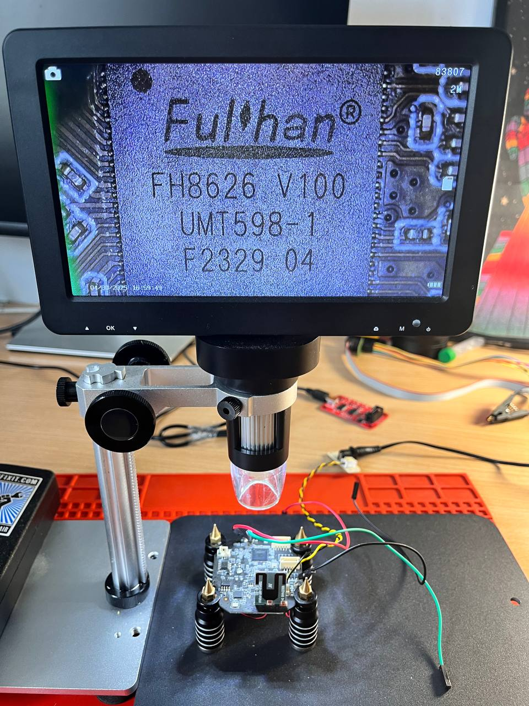
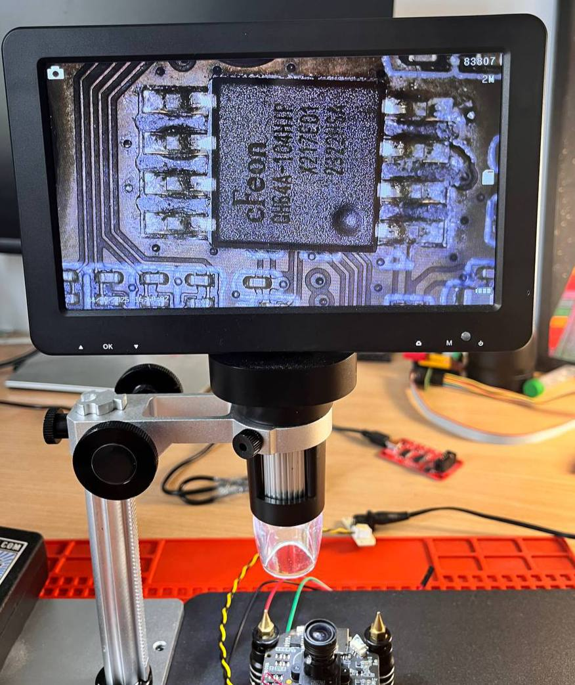
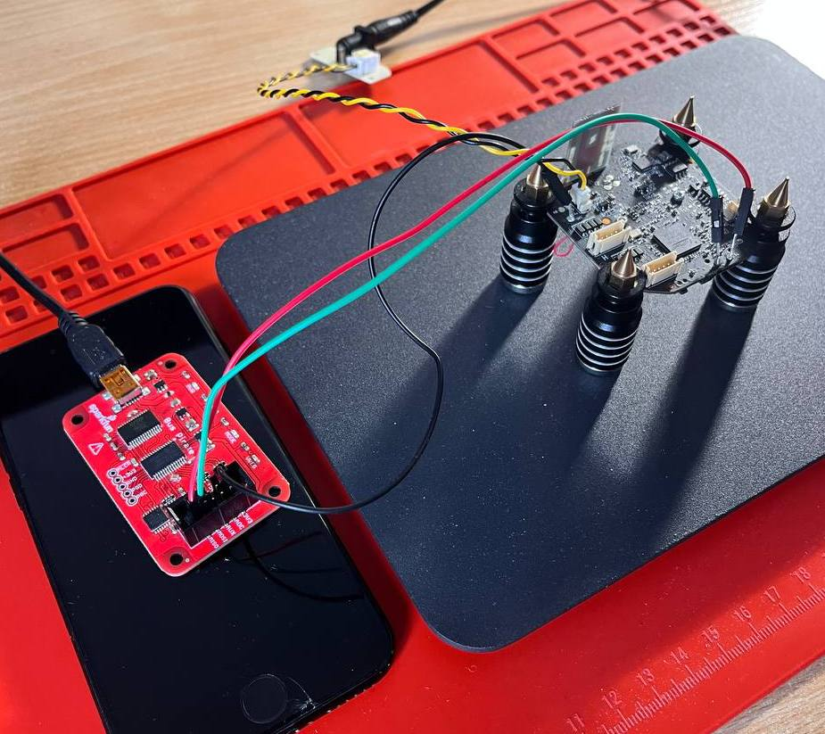
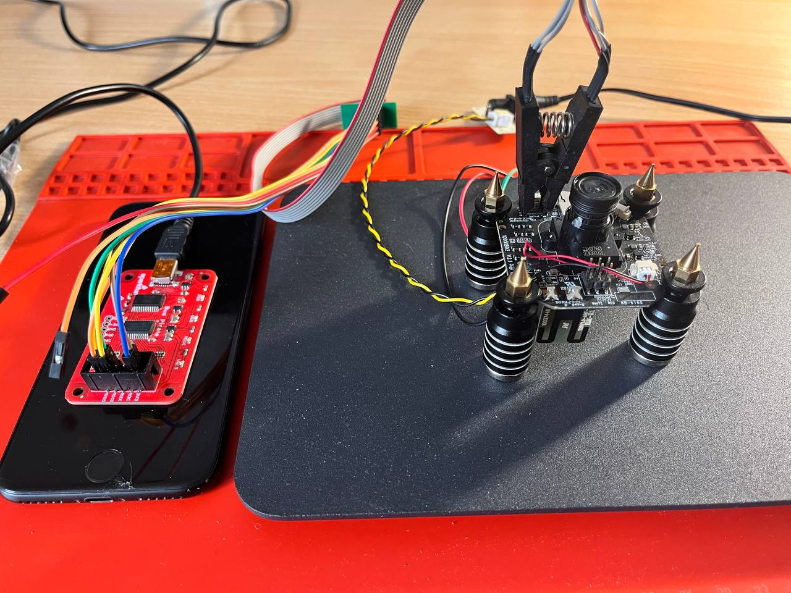
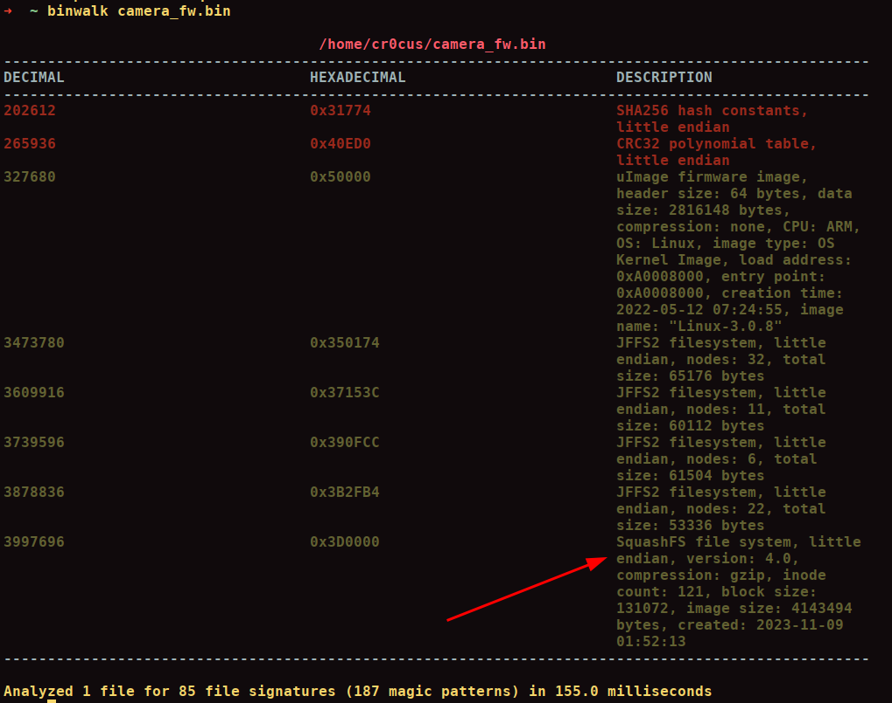

# Tenda CP3 reverse engineering

Around 1.5 years ago I decided to kick off my reverse-engineering journey with IoT devices. So, today I'd like to shed some light on my experience and results in the exploring security gaps of Chinese IP camera Tenda CP3.

What do I mean by reverse engineering of IoT devices?
First of all:
1) Device teardown and components identification
2) Dump of the firmware
3) Firmware analysis and vulnerabilities identification

During few programs analysis, I was lucky to found one vulnerability/backdoor which enabled me to carry out remote code execution attack and gain root access from the remote host.
Let's dive into it.


## Chapter 1: Camera teardown and components identification

Most likely, this is the easiest stage of the whole project since all you need is a solid screwdriver and 15 minutes of your free time. The are special internal engines which control the movement of the camera - thanks to it you can control the device remotely using the iOS/Android mobile app. After disabling few engines which are responsible for camera movement (you can control our camera from the iOS/Android app), the PCB from the camera is removed (Once all these engines are disabled, we take the PCB out and see the 'core' aka the brain of the device. In order to identify main elements with the best precision, I used the digital microscope. So, there are two main elements on PCB that need to be highlighted:

1) SoC of Tenda CP3 camera – _**Fulhan FH8626**_. This SoC is widely used in IP cameras and is responsible for image signal processing:


2) Flash chip – _**cFeon QH64A**_. This is the chip where the main camera firmware is located:


One crucial note here: I managed to find UART pins on the PCB right away, and they were even signed. Therefore, I didn’t need to identify them manually with help of multimeter (which isn't a rocket science though, but anyway). After soldering some wires to the UART pins, I connected them to the well-known hacking multi-tool called Bus Pirate. At this stage, I used Bus Pirate as USB-UART converter:


I used minicom in order to establish serial connection with the camera, plugged device and saw uboot/linux kernel logs immediately. I tried to type some sh1t from the keyboard but camera demanded login/password from me (which is quite obvious). In such a situation, we could try to find some credentials in the network, but we are hackers, aren't we? Let’s do it in a hacker way and dump firmware in order to get access to file system where root credentials are located!

## Chapter 2: Firmware dump

In order to have some access to the file system of camera, we need to dump whole firmware from flash-chip. So I used Bus Pirate again but in a slightly different configuration: I connected SPI-clip to the flash chip and according to the cFeon chip scheme, I connected SPI-clip to the Bus Pirate. Here is what it looks like:


Let's use the flashrom utility to dump the firmware:

```
sudo flashrom -p buspirate_spi:dev=/dev/ttyUSB0 -r camera_fw.bin
```

So, I dumped whole firmware from the device. Few minutes and 8-megabytes file of firmware in our hands.

## Chapter 3: Firmware file analysis

To inspect the contents of a firmware file, we can use the binwalk utility (without any flags initially) to analyze its structure:
```
binwalk camera_fw.bin
```

Here is the result:



At this stage, we are particularly interested in the SquashFS file system, as it typically contains the file system of the entire device. To extract the contents of all firmware partitions, including SquashFS, we can use binwalk with the -e flag. This will unpack the firmware and provide access to the device's file system:


I highlighted shadow file since it contains hash of root-password:

```
root:7h2yflPlPVV5.:18545:0:99999:7:::
```

To decrypt this hash, we could use a tool like hashcat. However, in this case, a quick Google search revealed that someone has already cracked this hash (kudos to them!). The root password is tdrootfs. Using this password, open minicom, log in as root with the password tdrootfs, and voilà - we now have full access to the device:


## Chapter 4: analyzing runtime of device

With full access to the device, we can begin investigating how it works. Let's start by listing all running processes to understand the device's behavior:


By the way, I highly recommend using the ps command with the -t flag, as it displays a list of all threads created by running processes. You might wonder why I highlighted two specific processes: apollo and noodles. The reason is straightforward: since our camera interacts with the network, we should analyze all open ports to understand its network activity. You can do this using:

```
netstat -natpu
```

Here is the output:


As you can see, most of the open ports are associated with the two processes (apollo and noodles) I mentioned earlier. With this in mind, let’s dive into reverse engineering these processes to gain deeper insights into their functionality.

## Chapter 5: analyze and looking for vulnerabilities in noodles

Reverse engineering any binary begins with identifying its architecture:

```
➜  abin git:(master) ✗ file noodles
noodles: ELF 32-bit LSB executable, ARM, EABI5 version 1 (SYSV), dynamically linked, interpreter /lib/ld-uClibc.so.0, stripped
```

Running the file command on the noodles binary reveals that it is a 32-bit ARM executable. Additionally, I executed the strings command on the file and noticed that it is packed with the UPX packer, which suggests that the binary is compressed to obfuscate its contents:

```
This file is packed with the UPX executable packer http://upx.sf.net
```

So let's unpack it with:
```
upx -d noodles
```

load it into the Ghidra and start our analysis.

I analyzed the main function and identified two key sections of the code that are worth highlighting:

1) FUN_000151d0 -- this function creates socket, binds it to the  port 1300 and start listening for incoming connections:


2) and second part accepts connections from other hosts and receives input from the user:


We are particularly interested in the code segment responsible for parsing user input and executing specific functions based on that input. This section is critical, as it may reveal how the binary processes commands and interacts with the system:


From the code, we can see that sending the command "ELFEXEC" to the camera triggers the execution of an ELF binary. This functionality resembles a backdoor, which, given that this is a Chinese-manufactured device, might not be entirely surprising.

Note: The highlighted function FUN_000152a8 is responsible for parsing user input and is extensively used throughout the binary. For clarity, I later renamed it to input_cmd_checker. The expected command format for interacting with this function is as follows:

```
<ELFEXEC>some_sh1t</ELFEXEC>
```

After input_cmd_checker function, noodles starts vulnerable function FUN_00012a04:


Additionally, the function at FUN_00012274 handles the retrieval of a binary file from a remote host. Its implementation is straightforward: the device creates a file named based on the third parameter (param3) and writes all data received through a socket to this file.

The highlight of this analysis is the function at FUN_00017ca4 (marked in the red rectangle), which appears to be critical to the binary’s behavior:


This function blindly execute any code with the help of system function.

So camera downloads file from the host with ELFEXEC cmd, then it makes this file executable:


And then executes it:


austack_308 - name of the executable file.

## Chapter 6: creating an exploit

Initially, I considered developing a "reverse shell" exploit, where the target (in this case, the camera) would initiate a connection back to the host. However, this approach requires the netcat utility on the target device, which is not present on the camera. Fortunately, the camera has telnetd, which allows us to open any port we choose. This enables us to create a "bind shell" exploit instead.

    1) Connect to port 1300 on the camera;
    2) Send a payload containing the ELFEXEC command to access the vulnerable functions in the binary;
    3) Once step 2 is successful, the camera will "download" a binary from the host. In this case, the binary’s content will be:
    ```
      telnetd -p 8888 -l /bin/sh &
    ```

This command starts to listen on port 8888, providing access to a shell.

When the exploit is executed, it sends the payload, and the camera runs the telnetd command. Finally, we can connect from our host to port 8888 on the camera to gain shell access. Bingo!


